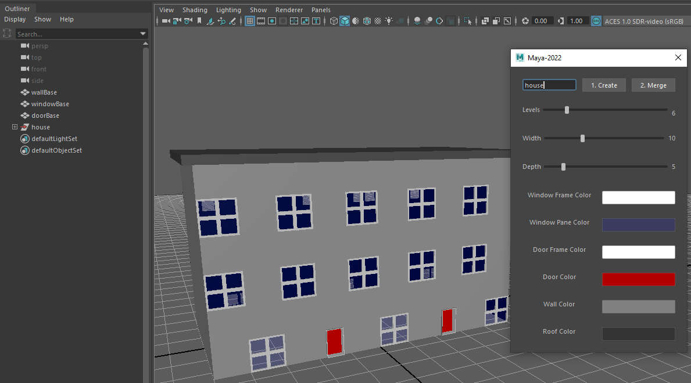

# Procedural Buildings in Maya: A Proof of Concept

Experimenting with python generated buildings as an alternative to the Visual Programming (e.g. Bifrost in Maya, Geometry Nodes in Blender)

## Description

A barebones dialog for procedural generation of buildings in Maya.  Name your building and choose its number of levels (height), width and depth.    

Click "1. Create" and the building is generated from basic planes (wall, window, door) each with basic blinn materials.  Colors (windows, doors, wall, roof) may be selected before or after creating a building.  

Once generated and while the building is selected, click "2. Merge" and the individual planes are combined to form a single object, and overlapping vertices are merged. This replaces the orginal object.

## Getting Started

### Dependencies

* Maya 2022 (first version to default to Python 3)
    * Could be converted to use Blender Api
    * The interface is in Pyside2/Qt and could run in Blender with changes
* Python 3
    * Converting code to python 2 should not be difficult
* Pyside2 or Qt
    * These come installed with Maya 2022

### Installing

* Save the python files to the Maya default user scripts directory
* In Maya 2022: "\Documents\maya\2022\scripts" 

### Executing program

* Load the buildingUI_user.py script into the script editor and run OR
* Add the script to a custom shelf button

## Help

This is a barebones example only.  There are plenty of user interface pitfalls.  Multiple instances of the same dialog may be opened.  The merge command assumes you still have the same building selected.  The pattern for windows/doors are hard coded as arrays in the code...

## Authors

[Scott Moses](https://fpnotebook.com/fpnmvccore/contact)

## Version History

* 0.1
    * Initial Release

## License

Creative Commons: Attribution 4.0 International

## Acknowledgments

* [Learn to Program & Model Procedural Cities in Unity/Blender](https://www.udemy.com/course/procedural-cities-in-unity-blender/)
    * Great, inspiring course by Penny De Byl and Michael Bridges
    * Unity focus is on C# procedural generation and gave me a fascinating look at "How did SimCity do that?"
    * Blender focus is on many efficient object creation methods including visual programming (geometric nodes)
    * Inspired me to try out Bifrost coding in Maya 
    * Inspired me to consider alternatives to visual programming (appears clunky compared with standard coding)
* [Python For Maya: Artist Friendly Programming](https://www.udemy.com/course/python-for-maya/)
    * Excellent course by Dhruv Govil
    * I originally followed his intro course on Pluralsight (Python for Maya Fundamentals)
    * Uses multiple projects to explore custom python library creation and user interface creation including Qt/Pyside and PyMel

